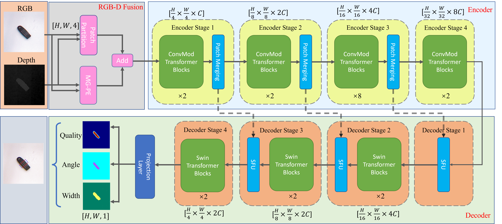

# MCT-Grasp
MCT-Grasp: A Novel Grasp Detection using  Multimodal Embedding and Convolutional  Modulation Transformer

# FrameWork

# Experiment
We provide a video of the experiments: [MCT-Grasp](https://youtu.be/5y6ALxQEtWk)
